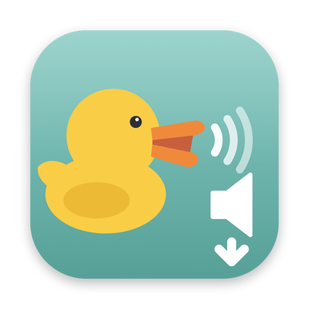
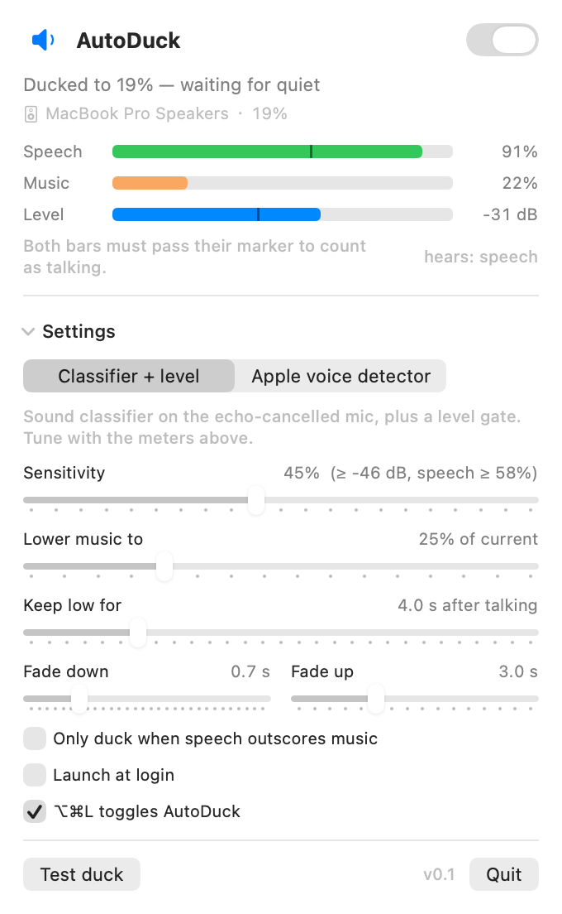
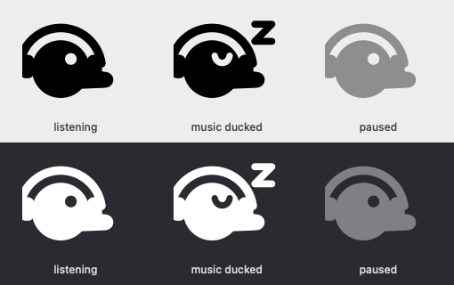
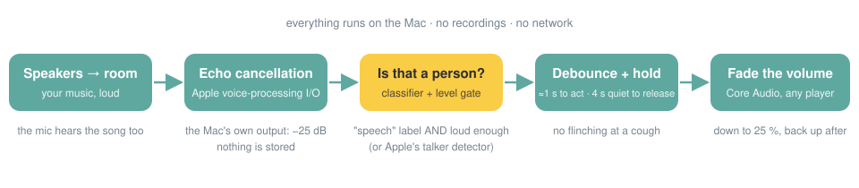
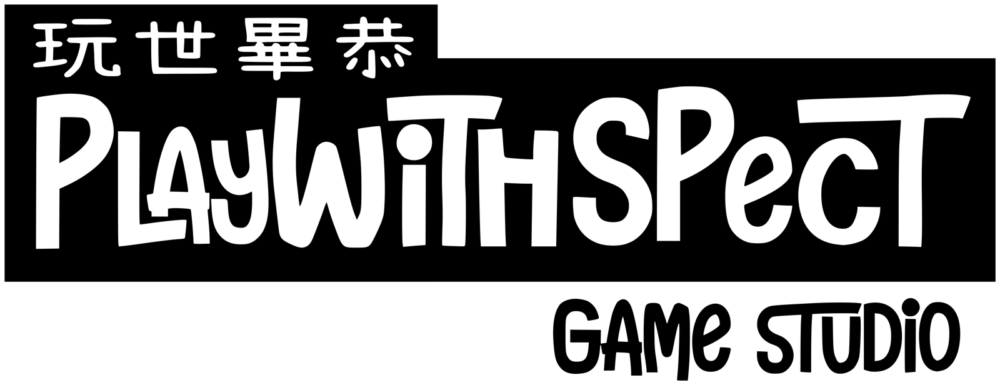

<p align="center">
  
</p>

<h1 align="center">AutoDuck</h1>

<p align="center"><strong>Play your music loud. When someone in the room talks to you, AutoDuck turns it down — and back up when they're done.</strong><br>
A tiny macOS menu-bar app. On-device, open source, and the duck falls asleep when the music rests.</p>

<p align="center">
  <a href="https://github.com/Sanforing/AutoDuck/actions/workflows/build.yml"></a>
  
  
  
  
</p>

<p align="center">
  <picture>
    <source media="(prefers-color-scheme: dark)" srcset="docs/images/popover-ducked-dark.png">
    
  </picture>
</p>

---

## The problem it solves

You like your music loud. You also live with people. Every "hey, got a sec?" means scrambling for the
volume keys, losing your thread, and the vibe is gone.

AutoDuck is **cinematic audio ducking for real rooms**: it listens through the Mac's microphone,
ignores the music the Mac itself is playing, and when it hears a human voice it fades the system volume
down to a level you can talk over. A few seconds of quiet later, the music swells back. You never touch a key.

<p align="center">
  
</p>

## What it does

- **Ducks any player** — Apple Music, Spotify, YouTube, games. It moves the Mac's volume, not the app's.
- **Ignores its own music.** Apple's voice-processing echo cancellation subtracts what the Mac is
  playing before detection, so vocals in a song don't count as "someone talking".
- **Decides like a person would.** Apple's on-device sound classifier has to say *speech* **and** the
  voice has to be loud enough to be in the room — for about a second — before it acts. Both are live
  meters in the popover, with markers, so you can see exactly why it ducked.
- **Gets out of your way.** Touch the volume keys while it's ducked and it hands control back until the
  conversation ends. Quit (or crash) and your volume is restored.
- **Stays invisible.** A menu-bar duck. No window, no dock icon, no notifications. ⌥⌘L pauses it anywhere.
- **Private by construction.** Audio is analysed in memory and discarded. No recordings, no uploads,
  no analytics, no network code at all. This repo is the proof.

## Install

Pre-release — there is no notarized download yet. Building takes one command (Xcode 15+ / macOS 14+):

```sh
git clone https://github.com/Sanforing/AutoDuck.git && cd AutoDuck
Scripts/build-app.sh --run        # → build/AutoDuck.app, launched; look for the duck in the menu bar
```

Grant microphone access when asked (that's the whole job). Then play something loud and say hello from
across the room.

> Sign with your own identity to keep the permission across rebuilds:
> `SIGN_IDENTITY="Apple Development: …" Scripts/build-app.sh`. Ad-hoc builds may need
> `Scripts/reset-permissions.sh` after a rebuild.

## How it hears you

<p align="center"></p>

Two detectors, switchable in the popover:

| Mode | How | When to use |
|---|---|---|
| **Classifier + level** (default) | Apple `SoundAnalysis` classifier on the echo-cancelled mic (0.75 s windows, 5×/s) **and** a post-echo level threshold; one *Sensitivity* slider moves both | Shows its work; tune it with the meters |
| **Apple voice detector** | The talker detector inside the voice-processing unit (the one behind "you're muted" hints) | Fewer false alarms from vocals; may need you to speak up |

### What we learned building it (the part HN will want)

Measured on a MacBook Pro, macOS 26 — the findings that shaped the code:

- `AVAudioEngine` + `setVoiceProcessingEnabled(true)`: **don't touch `mainMixerNode`.** Connecting the
  mixer brings it up at 44.1 kHz while VPIO runs at 48 kHz → `start()` fails with `-10875`. Input-only works.
- The voice-processing input node advertises a **9-channel** format whose channels are identical junk.
  Tap it as **mono at the node's sample rate** and you get the real echo-cancelled signal.
- Echo of the Mac's own playback: raw mic −24 dB → after cancellation −50 dB (≈25 dB gone). But the
  residue still *classifies as speech* about half the time — the classifier alone is not enough. With AGC
  off, a real person in the room measured 8–15 dB above that residue, which is what the level gate uses.
- Muting the VPIO input mutes it for **every** engine in the process, and a raw engine created after a
  VPIO engine produces no buffers — so the two detectors are modes, not parallel signals.
- macOS ducks *other apps'* audio whenever a voice-processing unit runs. Set
  `voiceProcessingOtherAudioDuckingConfiguration` to `.min` or the system fights your own ducking.

The probes that produced those numbers are in [`Sources/AutoDuck/Probe.swift`](Sources/AutoDuck/Probe.swift)
(`open build/AutoDuck.app --args --probe4 /path/to/song.mp3`). Key files:

| File | Role |
|---|---|
| [`Audio/MicMonitor.swift`](Sources/AutoDuck/Audio/MicMonitor.swift) | Voice-processing input, classifier, level statistics, Apple-VAD mode |
| [`Audio/VoiceActivityGate.swift`](Sources/AutoDuck/Audio/VoiceActivityGate.swift) | Debounce + hold → "someone is talking" |
| [`Audio/Ducker.swift`](Sources/AutoDuck/Audio/Ducker.swift) | Volume state machine, user-override handling |
| [`Audio/VolumeController.swift`](Sources/AutoDuck/Audio/VolumeController.swift) | Core Audio get/set volume, device & volume listeners |
| [`UI/MenuView.swift`](Sources/AutoDuck/UI/MenuView.swift), [`UI/DuckIcon.swift`](Sources/AutoDuck/UI/DuckIcon.swift) | The popover and the vector duck |

## Settings

| Setting | Default | Meaning |
|---|---|---|
| Detector | Classifier + level | see above |
| Sensitivity | 45 % | Level ≥ −46 dBFS and speech ≥ 58 %. Higher = hears quieter / farther voices, more false alarms |
| Lower music to | 25 % | Ducked volume as a fraction of your current volume |
| Keep low for | 4 s | Silence needed before restoring |
| Fade down / up | 0.7 s / 3 s | Ramp times |
| Only duck when speech outscores music | off | Stricter classifier rule |
| Launch at login · ⌥⌘L hotkey | off · on | |

It won't bother ducking if your volume is already ≤ 15 %.

## Honest limitations

- **Calls:** your own voice ducks the call audio. Pause with ⌥⌘L. Auto-pause when another app uses the
  mic is next on the list.
- **Bluetooth / AirPlay output:** the extra latency hurts echo cancellation; expect more false triggers.
  Built-in or wired speakers are the target.
- **Very loud music** distorts the speakers and leaves more echo residue — lower Sensitivity.
- **TV or a podcast in the room** is speech and will duck the music. By design, but worth knowing.
- It ducks even when nothing is playing (harmless; it restores). "Only when something is playing" is planned.
- Detection was tuned in one room on one Mac. **Reports from your room are the most valuable contribution**
  — see [docs/TESTING.md](docs/TESTING.md) for the protocol and [CONTRIBUTING.md](CONTRIBUTING.md).

## Roadmap

Next: real-room tuning on more Macs · auto-pause during calls · notarized `.dmg` with Sparkle updates ·
EN + 繁中 · "say something from the couch" calibration. The quality bar 1.0 has to pass is in
[docs/TESTING.md](docs/TESTING.md).

## Logs & diagnostics

```sh
/usr/bin/log stream --predicate 'subsystem == "com.autoduck.app"' --level info   # zsh shadows `log`
```

## Contributing

Small on purpose. Issues and PRs welcome — [CONTRIBUTING.md](CONTRIBUTING.md). Ground rules: audio never
touches disk or network; the UI stays calm; error messages say what happened and what to do.

## License

Code: [GPLv3](LICENSE). The AutoDuck name, duck mascot and icon are trademarks of Playwithspect — forks,
please pick your own name and duck ([TRADEMARK.md](TRADEMARK.md)).

A notarized, auto-updating build will be sold for a small one-time price to keep the side quest funded;
building from source is always free.

---

<p align="center">
  <picture>
    <source media="(prefers-color-scheme: dark)" srcset="docs/images/playwithspect-logo-dark.png">
    
  </picture>
</p>
<p align="center">A side quest by <strong>Playwithspect</strong> — playful at heart, respectful in craft.<br>
If AutoDuck saved your vibe, a ⭐ helps the next loud-music household find it.</p>
